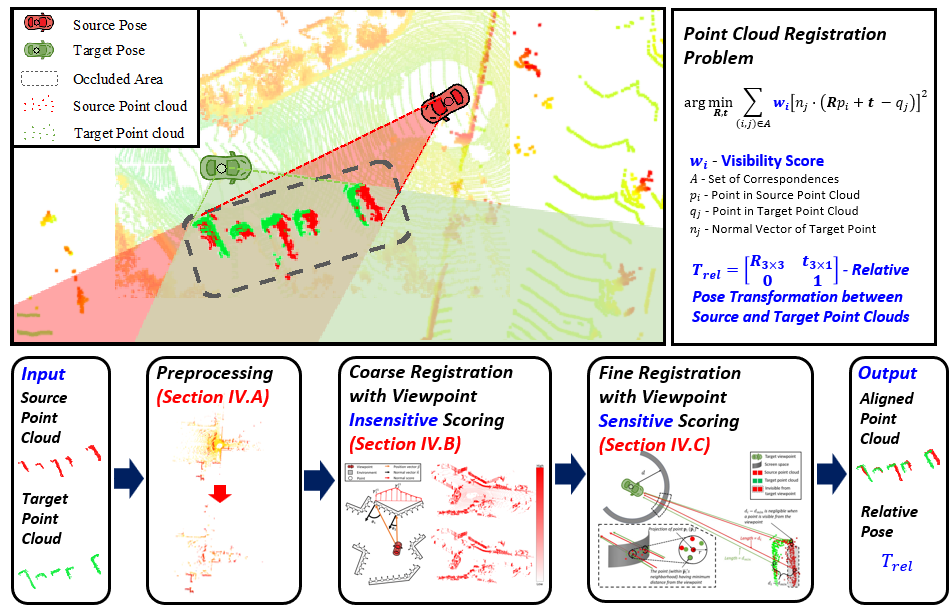
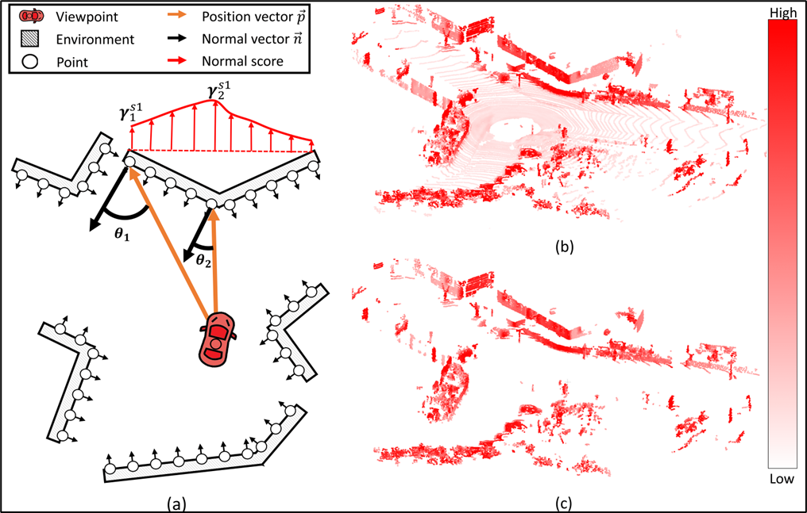
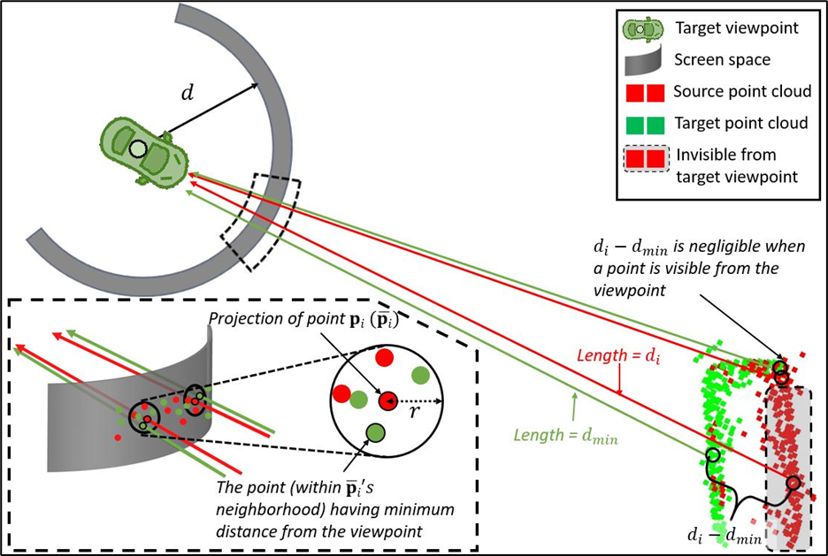

# Viewpoint-Aware ICP
**Viewpoint-Aware Visibility Scoring for Point Cloud Registration in Loop Closure** introduces a novel approach to address the point cloud registration problem in SLAM systems during loop closure. The paper presents the 'Viewpoint-Aware Visibility Scoring' technique, which enhances the accuracy of point cloud registration by considering visibility in two-stage method. By weighting the visibility of sensor data, the method enables more reliable localization and loop closure, ultimately improving the performance of SLAM.

## Paper
[I. Yoon, T. Islam, K. Kim, and C. Kwon “Viewpoint-Aware Visibility Scoring for Point Cloud Registration in Loop Closure,” IEEE Robotics and Automation Letters, Vol. 9, No. 5, Page 4146-4153, May 2024](https://ieeexplore.ieee.org/stamp/stamp.jsp?tp=&arnumber=10468644)

## Overall Architecture  


## Algorithm description

### 1st stage
**Coarse Registration with Viewpoint <span style="color: blue;">Insensitive</span> Scoring** <span style="color: red;">(Section IV.B)</span>



### 2nd stage
**Fine Registration with Viewpoint <span style="color: blue;">Sensitive</span> Scoring** <span style="color: red;">(Section IV.C)</span>


## Build
### Dependencies
This code is developed using the PCL (Point Cloud Library).  
If you are using ROS, the PCL library will be automatically installed.  
For non-ROS users, please install the [PCL library](https://github.com/PointCloudLibrary/pcl).

### example
If you have Open3D installed, you can visualize the process and results.  
(Note: The PCL visualizer may cause a segmentation fault error.)
```bash
git clone https://github.com/HMCL-UNIST/ViewpointAwareICP.git
cd ViewpointAwareICP

# Before build, you need to change to pcd file path in demo.cpp and demo_vis.cpp like "/home/<user>/ViewpointAwareICP/pcd/tgt.pcd"
# There are sample pcd file in /pcd which are obtained from lego loam with kitti 05 sequence
mkdir build
cmake ..
make

./demo
# with Open3d
./demo_vis
```

## Application
**You need to ensure that the source and target point cloud's origins are LiDAR Sensor position!!**\
To use this code, simply place the following 4 files into your workspace:
- v_score.h
- v_score.cpp
- viewpointAwareICP.h
- viewpointAwareICP.cpp

## Experiment Results
[](https://www.youtube.com/watch?v=QGaBLPjgFBc)


<!-- [](https://www.youtube.com/watch?v=_Hyst8YsnRg) -->


